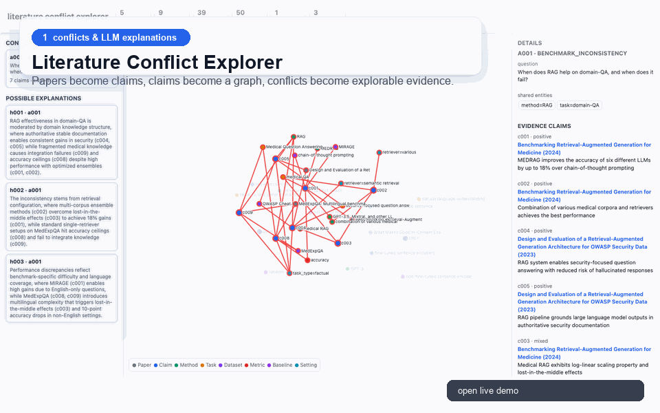

# aigraph

A graph-based literature conflict explorer for AI papers.

`aigraph` turns a small paper collection into typed claims, builds a heterogeneous
claim graph, detects local conflict/gap regions, and renders an interactive graph
explorer. The goal is to help people see where a research community disagrees,
which evidence supports each side, and what checks might be worth running next.

This is an alpha research prototype. It is not a claim that the system can
automatically determine scientific truth.

<p align="center">
  <a href="https://iamlilaj.github.io/literature-conflict-graph/">
    
  </a>
</p>

<p align="center">
  <a href="https://iamlilaj.github.io/literature-conflict-graph/"><strong>Open the live demo</strong></a>
  ·
  <a href="examples/rag_demo">View demo files</a>
</p>

GitHub README files cannot embed the interactive D3 page directly because
GitHub strips scripts and iframes from Markdown. The preview above links to the
live GitHub Pages demo.

## What It Does

```text
papers -> claims -> claim/citation graph -> conflicts/gaps -> hypotheses + insights -> visualization
```

- Fetches abstract-level paper metadata from OpenAlex.
- Fetches abstract-level preprints from arXiv when OpenAlex is rate-limited or
  citation metadata is not needed.
- Extracts structured claims with either deterministic rules or an LLM.
- Builds a typed graph over papers, claims, methods, tasks, datasets, metrics,
  baselines, settings, citation links, and lightweight semantic concepts.
- Detects benchmark inconsistencies, setting mismatches, bridge opportunities,
  metric mismatches, evidence gaps, community disconnects, and high-impact conflicts.
- Generates possible explanations and minimal follow-up checks.
- Surfaces community-level insights, such as two weakly connected communities
  that may share a unifying mechanism or evaluation protocol.
- Renders a static HTML graph explorer with paper links and evidence claims.

## Install

```bash
python -m pip install -e .
python -m pip install -e '.[real]'  # OpenAlex + OpenAI-compatible LLM extraction
python -m pip install -e '.[dev]'   # tests
```

Requires Python 3.10+.

## Quick Demo, No API Key

```bash
aigraph run-demo
aigraph visualize --input-dir outputs --output outputs/index.html
```

Open `outputs/index.html` in a browser.

The synthetic demo is deterministic and runs without network access or API keys.

## Included Real-Paper Demo

The repository includes a small sanitized RAG demo in `examples/rag_demo/`.
It was produced from OpenAlex metadata plus LLM claim extraction over a handful
of retrieval-augmented generation papers.

```bash
open examples/rag_demo/index.html
```

The demo includes:

- 5 real paper records with OpenAlex links.
- 9 extracted claims.
- 39 graph nodes and 50 graph edges.
- 1 detected benchmark inconsistency around RAG on domain QA.
- 3 LLM-generated possible explanations / follow-up checks.

To keep the repository lightweight and redistribution-friendly, this example
keeps paper titles, years, venues, and links, but omits full abstracts and paper
text. The extracted claims still include short evidence spans for inspection.

## Real-Paper Demo

Create a local `.env` file or export environment variables:

```bash
OPENAI_API_KEY=...
AIGRAPH_BASE_URL=https://your-openai-compatible-host/v1
AIGRAPH_MODEL=gpt-5.4
AIGRAPH_LLM_ENDPOINT=responses
AIGRAPH_REASONING_EFFORT=high
AIGRAPH_READER_MODE=mini
AIGRAPH_READER_MODEL=gpt-5.4-mini
AIGRAPH_READER_MAX_CANDIDATES=6
AIGRAPH_MAILTO=you@example.com
```

Then run:

```bash
aigraph run-real-demo \
  --query "retrieval augmented generation large language models" \
  --from-year 2020 \
  --to-year 2026 \
  --limit 5 \
  --output-dir outputs/openalex_rag

aigraph visualize \
  --input-dir outputs/openalex_rag \
  --output outputs/openalex_rag/index.html
```

LLM extraction calls the model once per paper. With the mini reader enabled,
the system first selects grounded candidate sentences, then sends only that
smaller pool to the strong extractor. Start with `--limit 5` or `--limit 10`
before scaling up.

## arXiv Demo

arXiv is useful for fast topic slices and is often less painful than citation
APIs. It does not provide citation counts through the Atom API, so citation
impact fields stay at zero, but topology and unified community insights still
work.

```bash
aigraph run-arxiv-demo \
  --query 'all:"large language models" AND (all:finance OR all:"time series" OR all:forecasting)' \
  --from-year 2020 \
  --to-year 2026 \
  --limit 30 \
  --insight-generator llm \
  --output-dir outputs/arxiv_finance_timeseries
```

For only fetching papers:

```bash
aigraph fetch-arxiv \
  --query 'all:"large language models" AND all:finance' \
  --limit 20 \
  --output data/arxiv_papers.jsonl
```

## Local Search Server

Run a Baidu-style local search page. Friends can enter a research topic and get
an automatically generated report plus interactive graph.

```bash
aigraph serve --host 0.0.0.0 --port 7860
```

Open locally:

```text
http://127.0.0.1:7860
```

To share from your own machine, expose the local server with a tunnel:

```bash
cloudflared tunnel --url http://localhost:7860
```

The server writes each run to `outputs/runs/{run_id}/` and defaults to arXiv,
20 papers, balanced representative paper selection, LLM claim extraction,
template hypotheses, and LLM community insights.
API keys stay in the backend environment and are never sent to the browser.

Paper retrieval uses a candidate-pool strategy before the graph is built:

- `balanced`: relevance + recency + topic diversity, with citation impact when available.
- `high-impact`: citation-aware selection for OpenAlex.
- `recent`: newer papers first, with light relevance filtering.

arXiv is stable for public demos but does not expose citation metadata, so arXiv
runs are marked as citation-light. OpenAlex is better for high-impact retrieval
but can be rate-limited. In OpenAlex mode, `--citation-weight` can make citation
impact the primary reranking signal without turning publication year into a hard
matching rule.

## Docker Deployment

Build the image:

```bash
docker build -t aigraph .
```

Run the server with a persistent outputs volume and backend API credentials:

```bash
docker run -d \
  --name aigraph \
  -p 7860:7860 \
  --env-file .env \
  -v "$(pwd)/outputs:/app/outputs" \
  aigraph
```

Then open:

```text
http://YOUR_SERVER_IP:7860
```

The container starts:

```bash
aigraph serve --host 0.0.0.0 --port 7860 --runs-dir outputs/runs
```

`outputs/` should stay mounted so runs, community graph state, and analytics
survive container restarts.

If you prefer Compose:

```bash
docker compose up -d --build
```

The included `docker-compose.yml` maps port `7860`, loads `.env`, and persists
`./outputs` into the container.

## CLI

```bash
aigraph fetch-openalex --query "retrieval augmented generation" --limit 20 --strategy balanced --citation-weight 0.45 --output data/papers.jsonl
aigraph fetch-arxiv --query 'all:"large language models" AND all:finance' --limit 20 --strategy balanced --output data/arxiv_papers.jsonl
aigraph extract --input data/papers.jsonl --output outputs/claims.jsonl --extractor llm --reader mini --reader-model gpt-5.4-mini --reader-max-candidates 6
aigraph build-graph --claims outputs/claims.jsonl --papers data/papers.jsonl --output outputs/graph.json
aigraph detect-anomalies --graph outputs/graph.json --claims outputs/claims.jsonl --output outputs/anomalies.jsonl
aigraph generate-hypotheses --anomalies outputs/anomalies.jsonl --claims outputs/claims.jsonl --output outputs/hypotheses.jsonl --generator llm
aigraph generate-insights --graph outputs/graph.json --claims outputs/claims.jsonl --papers data/papers.jsonl --anomalies outputs/anomalies.jsonl --output outputs/insights.jsonl
aigraph select --hypotheses outputs/hypotheses.jsonl --claims outputs/claims.jsonl --anomalies outputs/anomalies.jsonl --papers data/papers.jsonl --insights outputs/insights.jsonl --output outputs/report.md
aigraph visualize --input-dir outputs --output outputs/index.html
```

## Output Files

- `papers.jsonl`: input paper metadata.
- `claims.jsonl`: extracted typed claims with evidence spans.
- `reader_candidates.jsonl`: optional debug artifact with grounded reader candidates per paper.
- `graph.json`: NetworkX node-link graph.
- `anomalies.jsonl`: detected conflict/gap regions.
- `hypotheses.jsonl`: possible explanations and follow-up checks.
- `insights.jsonl`: community-level topology/citation insights.
- `selected_hypotheses.md`: scored Markdown report.
- `index.html`: static D3 graph explorer.

## Current Limitations

- Abstract-level only by default: no PDF parsing, tables, figures, or section-level grounding.
- LLM-extracted claims can be noisy and should be verified by humans.
- Claim links currently resolve to source papers, not exact PDF paragraphs.
- Canonicalization of methods/tasks is heuristic.
- LLM-generated explanations are candidate interpretations, not verified conclusions.
- Scoring weights are hand-set, not learned from human feedback.

## Development

```bash
pytest -q
```

Tests use fake clients for OpenAlex and LLM calls; they do not make network or API requests.

## License

MIT
